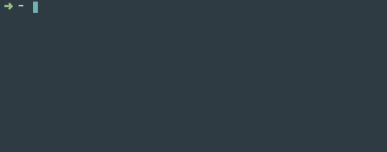

# ADH: Docker 'Useful Commands' Helper

##  Description

    This package will help you working with Docker. 
    
   
##  Installation

    npm install -g adh
  
##  Usage: adh [options] [command]

  Commands:

    nginx [options]            Run nginx with a volume in the current directory 
    ps                         Formatted ps -> docker ps --format 'table {{.ID}}  {{.Names}}  {{.Image}}  {{.Status}} {{.Ports}}'
    ps-a, psa                  Formatted ps-a showing all containers (default shows just running)
    remove-containers, rc      Remove all containers -> docker ps -aq | awk '{print $1} | xargs docker rm -f'
    remove-images, ri          Remove all images -> docker rmi -f $(docker images -q)
    remove-none-images         Remove none images -> docker images | grep "^<none>" | awk '{print $3}' | xargs -I {} --no-run-if-empty docker rmi {} || true
    remove-exited-containers   Remove exited containers -> docker rm $(docker ps -q -f status=exited)
    remove-volumes             Remove all named volumes -> docker volume rm $(docker volume ls -qf dangling=true)
    kill-containers, kc        Kill all containers -> docker kill $(docker ps -q)
    create-local-registry      Create a local registry -> docker run -d -p 5000:5000 --restart=always --name local-registry registry:2
    stop                       GUI to stop multiple running containers
        

  Options:

    -h, --help     output usage information
    -V, --version  output the version number

---

####  Usage: nginx [options]

  Run nginx with a volume in the current directory 

  Options:

    -h, --help         output usage information
    -f, --force        Force remove nginx container with same name
    -p, --port <port>  Host port. (Default: 8888)
    -n, --name <name>  Container name (Default: adh-nginx)

  Examples:

    $ adh nginx -p 8080 -n myNginx -f
    $ adh nginx -n myOtherNginx
